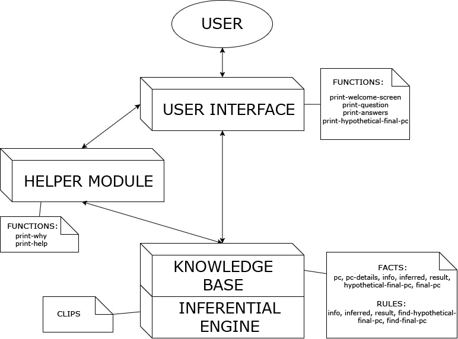

# The Computer Guy

Design and Development of an Expert System that recommends computers exploiting User Modeling question-driven technique.

## Introduction
*The Computer Guy* is an expert system to help users in buying the best-suitable pc that meets their needs, indipendently if he/she has knowledge in the field of calculators through answering to simple questions.

The system's main objective is the user profilation starting from scratch and using logic inference to fit the specific user's shape. On the basis of the acquired information, the system selects a set of potential pcs from a list of available configurations and proposes them to the user.

The knowledge of an expert in the field - that in our case corresponds to the knowledge of one of the developers - was exploited to generate a Knowledge Base. Hence it is able to generate new knowledge through a process of inference, regulated by a set of rules divided per category. However this system can give results with a percentual of uncertainty since it works with uncertain knowledge.

The system is not replicable by a simple written questionnaire since it learns and selects the right questions to do, avoiding unuseful questions according to the answers that the user has already given to the system. It is also possible to do profilation about third users in case of gift (the person who is buying the pc is not the final user). In that case the level of uncertainty will be higher.

## Context of use
This kind of expert system can be collocated in two different environments:

1. A distribution company, that buys calculators in bulk from manufacturing companies and does of distribution the principal business. In this specific case the expert system will decrease costs relative to the retribution of the client assistance staff.
2. A manufacturing company, that produces pcs and wants to extend its business directly commercializing the products that produces. In this case the expert system maximizes the earnings eliminating the costs linked to the distribution companies.

## Architecture

The architecture of the system is very modular and divides into several parts:
* The User Interface: contains all the functions needed to interact with the user. 
* The Knowledge Base: contains all the facts and inference rules that represent the expert knowledge model that the system is able to manipulate and elaborate during the execution.
* The Inferential Engine: contains the engine to infer new knowledge taking into consideration the answers of the user to the questions selected by the system. 
* The Helper Module: is able to provide further information to the user regarding not only the meaning of the questions but also the reasons why that questions was selected.   

## Authors

All the following authors have equally contributed to this project (listed in alphabetical order by surname):

- Tiziano Franza ([github](https://github.com/frantiz96))
- Davide Lofrese ([github](https://github.com/davidelofrese))
